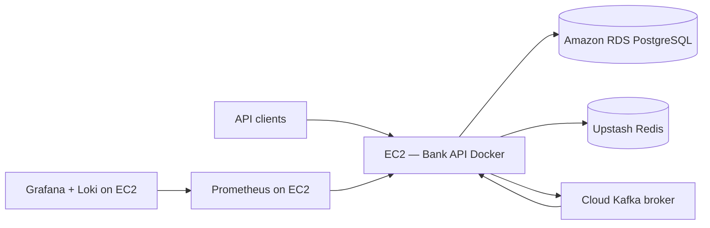

# Bank API

Minimalist modular-monolith banking REST API — IAM, double-entry accounts, idempotent transfers, loans, append-only audit, and async notifications. **Deployed on AWS EC2** with **Amazon RDS PostgreSQL**, **Upstash Redis**, and **Kafka** consumed from a cloud broker; **Prometheus, Grafana, and Loki** on EC2 for external observability.

[](https://openjdk.org/)
[](https://spring.io/projects/spring-boot)

---

## Table of contents

- [About](#about)
- [Features](#features)
- [Documentation](#documentation)
- [Tech stack](#tech-stack)
- [Architecture at a glance](#architecture-at-a-glance)
- [Prerequisites](#prerequisites)
- [Quick start](#quick-start)
- [Configuration](#configuration)
- [API overview](#api-overview)
- [Project structure](#project-structure)
- [Deployment](#deployment)
- [Testing](#testing)
- [Maintaining documentation](#maintaining-documentation)
- [Contributing](#contributing)
- [Security & compliance](#security--compliance)
- [License](#license)

---

## About

Bank API is a **portfolio-grade educational banking backend** built as a Spring Boot modular monolith. Nine Maven modules (`bank-shared` through `bank-boot`) implement IAM with JWT, ledger-based accounts, payment transfers with idempotency, loan amortization, immutable audit, and event-driven notifications.

The project is intentionally **minimalist but production-shaped**: it runs in Docker on **AWS EC2**, connects to **RDS** for persistence, **Upstash Redis** for tokens/idempotency/rate limits, and a **cloud Kafka** instance for notification dispatch. Observability (metrics + logs) is handled by **Prometheus, Grafana, and Loki** running on EC2 — not embedded in the Spring app.

| | |
|---|---|
| **Version** | 0.4.0 |
| **Status** | Stable (portfolio / educational) |
| **Primary API prefix** | `/api/v1/` |
| **Live / health check** | [{{YOUR_DOMAIN}}/actuator/health](https://{{YOUR_DOMAIN_OR_EC2}}/actuator/health) |
| **OpenAPI (Swagger)** | [{{YOUR_DOMAIN}}/swagger-ui.html](https://{{YOUR_DOMAIN_OR_EC2}}/swagger-ui.html) |

---

## Features

Short list for the README; full detail lives in generated docs.

- JWT auth (RS256) with Redis refresh rotation, blocklist, and RBAC permissions
- Double-entry ledger accounts — balance derived, never stored
- Idempotent transfers with state machine and reversal support
- Loan origination, approval, amortization schedule, and repayments
- Append-only audit trail (DB trigger + JSONB payloads)
- Kafka-backed notification dispatch (cloud broker in AWS; local Kafka in dev)
- Redis token-bucket rate limiting in docker/AWS profile
- Prometheus metrics + structured audit/access logs + Loki shipping

See [Project Features](docs/project/generated/ProjectFeature.md) for the complete feature breakdown.

---

## Documentation

This repository keeps **structured source** in `docs/project/source/` (YAML frontmatter + notes) and **human-readable docs** in `docs/project/generated/`, produced by `docs/project/yaml_to_markdown.py`. The TypeScript contract for portfolio tools is `docs/project/source/schema.ts`.

### Documentation index

| Document | What you will find | Read |
|----------|-------------------|------|
| **Overview** | Problem, solution, metrics, links, AWS deploy context | [ProjectOverview.md](docs/project/generated/ProjectOverview.md) |
| **Metadata** | Project id, version, tech stack, URLs | [ProjectMetadata.md](docs/project/generated/ProjectMetadata.md) |
| **API schema** | Endpoints, auth, rate limits, examples | [APISchema.md](docs/project/generated/APISchema.md) |
| **Architecture** | Layers, patterns, diagram, data flows | [ProjectArchitecture.md](docs/project/generated/ProjectArchitecture.md) |
| **Infrastructure** | Docker, EC2, RDS, Upstash Redis, Kafka, observability | [ProjectInfrastructure.md](docs/project/generated/ProjectInfrastructure.md) |
| **Features** | Feature cards, snippets, status per area | [ProjectFeature.md](docs/project/generated/ProjectFeature.md) |
| **Code showcase** | Curated code examples from the codebase | [ProjectCodeShowCase.md](docs/project/generated/ProjectCodeShowCase.md) |
| **Generated index** | Auto-generated hub linking all of the above | [docs/project/generated/README.md](docs/project/generated/README.md) |

### Additional guides

| Document | Purpose |
|----------|---------|
| [docs/OBSERVABILITY.md](docs/OBSERVABILITY.md) | Logs, metrics, Loki, local stack quick start |
| [docker/MONITORING.md](docker/MONITORING.md) | Prometheus/Grafana wiring (local vs AWS) |
| [docker/README.md](docker/README.md) | Compose files, validate-env, build commands |
| [docs/v0.2.0/CONFIGURATION.md](docs/v0.2.0/CONFIGURATION.md) | Environment variables and Spring profiles |

### Source vs generated

| Path | Purpose |
|------|---------|
| `docs/project/source/*.md` | Edit YAML frontmatter here (machine-friendly, matches `schema.ts`) |
| `docs/project/generated/*.md` | Read here on GitHub / in the IDE (do not edit by hand) |
| `docs/project/yaml_to_markdown.py` | Regenerates `docs/project/generated/` from `docs/project/source/` |

```bash
python3 -m venv /tmp/bank-docs-venv
source /tmp/bank-docs-venv/bin/activate
pip install pyyaml
python docs/project/yaml_to_markdown.py
deactivate && rm -rf /tmp/bank-docs-venv
```

---

## Tech stack

- **Java 21** — records, pattern matching, ZGC in Docker
- **Spring Boot 4.0.5** — Web, Security, Data JPA, Kafka, Actuator
- **Spring Modulith 2.0.5** — module boundaries and events
- **PostgreSQL 16** — Amazon RDS in production; containerized locally
- **Upstash Redis** — refresh tokens, blocklist, idempotency, rate limits
- **Apache Kafka** — notification dispatch (cloud instance in AWS)
- **Flyway** — 15 schema migrations
- **springdoc-openapi** — Swagger UI at `/swagger-ui.html`
- **Docker** — multi-stage Temurin 21 JRE image
- **Prometheus + Grafana + Loki** — external observability on EC2

---

## Architecture at a glance

Modular monolith: each `bank-*` module follows `api → application → domain ← infrastructure`. Cross-module integration uses `ApplicationEvent` (AFTER_COMMIT) and, in the docker/AWS profile, **Kafka** for notification dispatch. Production runs a single app container on EC2; data services are external.



Full diagram, layers, and decisions: [ProjectArchitecture.md](docs/project/generated/ProjectArchitecture.md).

---

## Prerequisites

- **Java 21** and **Maven 3.9+** (or use `./mvnw`)
- **Docker & Docker Compose** for container deploy and local full stack
- **PostgreSQL**, **Redis**, and **Kafka** — external in production (RDS, Upstash, cloud broker); bundled in `docker/compose.local.yml` for dev
- Copy [`.env.example`](.env.example) to `.env` and fill all values (`./docker/validate-env.sh` helps)

---

## Quick start

### Local development (Maven)

```bash
git clone https://github.com/alexisTrejo11/bank-api
cd bank-api
cp .env.example .env   # adjust for local postgres profile or infra-only Docker

# Optional: start infra only
docker compose --env-file .env -f docker/compose.local.yml up -d postgres redis kafka

./mvnw -pl bank-boot -am spring-boot:run
```

- Health: http://127.0.0.1:8080/actuator/health
- Swagger: http://127.0.0.1:8080/swagger-ui.html

### Docker — local full stack

```bash
cp .env.example .env
./docker/validate-env.sh local
docker compose --env-file .env -f docker/compose.local.yml up -d --build
```

- API (via nginx): http://localhost:${NGINX_HTTP_PORT:-80}
- Grafana: http://localhost:${GRAFANA_PORT:-3000}
- Prometheus: http://localhost:${PROMETHEUS_PORT:-9090}

### Docker — production / EC2 (app only)

```bash
cp .env.example .env   # point to RDS, Upstash Redis, cloud Kafka
./docker/validate-env.sh app
docker compose --env-file .env -f docker/compose.yml up -d --build
```

API on host port **`${APP_HTTP_PORT}`** → container **8080**. See [ProjectInfrastructure.md](docs/project/generated/ProjectInfrastructure.md).

---

## Configuration

Copy `.env.example` to `.env`. Minimum variables for AWS/docker deploy:

| Variable | Description |
|----------|-------------|
| `SPRING_DATASOURCE_*` | Amazon RDS PostgreSQL JDBC URL, user, password |
| `SPRING_DATA_REDIS_*` | Upstash Redis host, port, password |
| `SPRING_KAFKA_BOOTSTRAP_SERVERS` | Cloud Kafka broker address |
| `BANK_KAFKA_ENABLED` | `true` to enable Kafka integration |
| `BANK_NOTIFICATIONS_DISPATCH_MODE` | `kafka` for AWS notification pipeline |
| `BANK_SECURITY_JWT_*_PEM` | RSA key pair for stable JWT across restarts |
| `MANAGEMENT_ENDPOINTS_WEB_EXPOSURE_INCLUDE` | e.g. `health,info,prometheus` |
| `APP_HTTP_PORT` | Host port for EC2 security group |

Full list: [.env.example](.env.example) and [docs/v0.2.0/CONFIGURATION.md](docs/v0.2.0/CONFIGURATION.md).

---

## API overview

| Area | Base path | Doc |
|------|-----------|-----|
| Auth | `/api/v1/auth/` | [APISchema.md](docs/project/generated/APISchema.md) |
| Accounts | `/api/v1/accounts/` | [APISchema.md](docs/project/generated/APISchema.md) |
| Payments | `/api/v1/payments/` | [APISchema.md](docs/project/generated/APISchema.md) |
| Loans | `/api/v1/loans/` | [APISchema.md](docs/project/generated/APISchema.md) |
| Audit | `/api/v1/audit/` | [APISchema.md](docs/project/generated/APISchema.md) |
| Notifications | `/api/v1/notifications/monitoring/` | [APISchema.md](docs/project/generated/APISchema.md) |
| Service | `/actuator/health`, `/swagger-ui.html` | [APISchema.md](docs/project/generated/APISchema.md) |

Authentication: `Authorization: Bearer <access_token>` (RS256 JWT). Payments require `Idempotency-Key: <UUID>` header.

---

## Project structure

```
bank-api/
├── bank-shared/          # Money, IDs, events, ApiResponse, OpenAPI keys
├── bank-iam/             # Auth, JWT, RBAC
├── bank-accounts/        # Accounts, ledger
├── bank-payments/        # Transfers, idempotency
├── bank-loans/           # Origination, repayments
├── bank-audit/           # Append-only audit
├── bank-notifications/   # Email/SMS, Kafka dispatch
├── bank-config/          # Security, CORS, exception handling
├── bank-boot/            # Spring Boot entry, Flyway migrations, infra wiring
├── docker/               # Dockerfile, compose.yml, compose.local.yml, monitoring
├── docs/
│   ├── project/
│   │   ├── source/       # YAML source docs (edit these)
│   │   ├── generated/    # Readable Markdown (generated)
│   │   └── yaml_to_markdown.py
│   └── OBSERVABILITY.md
├── .agents/              # Architecture and domain reference for agents
└── pom.xml
```

---

## Deployment

**Current production layout:** single **EC2** instance runs `docker/compose.yml` (app container only). **RDS PostgreSQL**, **Upstash Redis**, and a **cloud Kafka** broker are external services configured via `.env`. **Prometheus, Grafana, and Loki** run on EC2 (or a companion instance) and scrape `/actuator/prometheus` plus ship logs from `/app/logs`.

Replace `{{YOUR_DOMAIN_OR_EC2}}` placeholders in docs and README with your real hostname once published.

Details: [ProjectInfrastructure.md](docs/project/generated/ProjectInfrastructure.md) · [docker/MONITORING.md](docker/MONITORING.md).

---

## Testing

```bash
./mvnw verify
# Integration tests in bank-boot (NotificationsMonitoringIT, PaymentsModuleIT, …)
```

---

## Maintaining documentation

1. Edit YAML in `docs/project/source/<Section>.md` (keep fields aligned with `docs/project/source/schema.ts`).
2. Run `python docs/project/yaml_to_markdown.py` (see [Documentation](#documentation) for venv one-liner).
3. Commit both `docs/project/source/` and `docs/project/generated/` if you want docs visible on GitHub without running the script.

Optional notes that are not part of the schema (warnings, AWS tips) go in the **Markdown body** below the closing `---` in each source file — they appear under **Additional notes** in generated files.

---

## Contributing

1. Fork the repository
2. Create a feature branch (`git checkout -b feature/my-change`)
3. Commit with clear messages (see [docs/v0.1.0/PR_CONVENTIONS.md](docs/v0.1.0/PR_CONVENTIONS.md))
4. Open a pull request

For monorepo module commits, see [docs/MONOREPO_ATOMIC_COMMITS.md](docs/MONOREPO_ATOMIC_COMMITS.md).

---

## Security & compliance

This is an **educational / portfolio API** — not licensed banking software. It implements JWT auth, RBAC, append-only audit, and idempotent payments, but is **not** certified for regulated financial use without formal security review.

Report vulnerabilities privately to the repository owner via GitHub Security Advisories.

---

## License

See [LICENSE](LICENSE) file if present; otherwise contact the repository owner.

---

## Links

| Resource | URL |
|----------|-----|
| Repository | [https://github.com/alexisTrejo11/bank-api](https://github.com/alexisTrejo11/bank-api) |
| Documentation hub | [docs/project/generated/README.md](docs/project/generated/README.md) |
| Demo / health | [https://{{YOUR_DOMAIN_OR_EC2}}/actuator/health](https://{{YOUR_DOMAIN_OR_EC2}}/actuator/health) |
